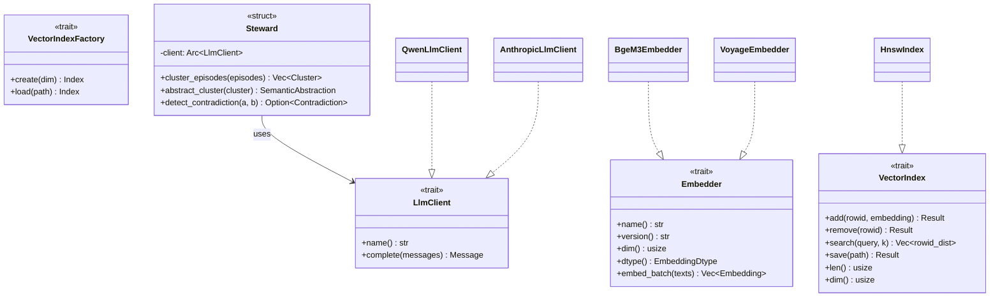

# ADR-0002: Load-bearing trait shapes

**Status:** Accepted
**Date:** 2026-05-05 (proposed) · 2026-05-20 (re-stamped Accepted to reflect shipped state)
**Deciders:** Solo project
**Depends on:** ADR-0001

## Status note (2026-05-20)

This ADR sat at **Proposed** from v0.1.0 through v0.11.0 while every
action item below was, in fact, implemented in `ec482b4` ("Commit 1.0:
workspace skeleton + Apache-2.0 + ADRs 0001/0002") and has been load-
bearing ever since. Re-stamping to **Accepted** to close the doc/code
drift. Two small amendments that landed after this ADR was first
written:

1. **`VectorIndex::add` / `::remove` take `&self`, not `&mut self`.**
   The original inline code below shows `&mut self`. ADR-0003 §
   "Operational invariants → VectorIndex reference semantics" amended
   this so the writer thread and read pool can share one
   `Arc<dyn VectorIndex + Send + Sync>`; the live trait in
   [solo-core/src/vector_index.rs:24,29](../../crates/solo-core/src/vector_index.rs#L24)
   uses `&self`. Treat the sketch in this ADR's "Trait shapes" section
   as historical — the canonical signatures live in code.

2. **`LlmClient::is_real_llm() -> bool`** was added later (default
   `true`) so the writer's contradiction sweep can early-return when
   the steward client is a deterministic test stub. Additive — the
   original trait surface is unchanged.

## Context

Three extension points are load-bearing for the Solo architecture:

1. **The embedder.** Per `architecture-feedback-and-plan.md §2.4` and `solo-v0-architecture.md §3.2`, the embedder must be swappable — BGE-M3 via candle is the v0 default, but Voyage-3-large hosted, all-MiniLM-L6-v2, and future models all need to live behind the same shape. The migration tool `solo reembed` reads this trait's `name()` and `version()` to decide when to re-embed.
2. **The vector index.** Per `solo-v0-architecture.md §3.2` Risk 1 mitigation, the HNSW sidecar (hnswlib-rs) is the v0 implementation, but if vectorlite or sqlite-vec native HNSW lands, the swap should be one-impl change rather than rewiring the recall path.
3. **The steward LLM.** Per `solo-v0-architecture.md §3.4`, the consolidation pass calls a user-pluggable LLM — local Qwen3 via candle for offline, Anthropic Claude or OpenAI GPT for hosted, any MCP-callable LLM in principle.

These three shapes are the project's first ABI. Every later commit imports them. Get them wrong now and you'll be ripping out call sites in week 3. Get them right and the rest of the architecture clicks into place.

A fourth concern — the `Steward` itself — was originally proposed as a trait. This ADR argues against that: the steward's clustering, abstraction, and contradiction-detection logic *is the IP* of Solo's consolidation pass, and re-implementing it per LLM backend would duplicate effort and leak prompt engineering across crates. Make `Steward` a struct that uses an `LlmClient` trait — the LLM is the swap point, not the consolidation logic.

## Decision

Define three traits in `solo-core` — `Embedder`, `VectorIndex`, `LlmClient` — and one struct in `solo-steward` (`Steward`) that uses `LlmClient`. Define a `VectorIndexFactory` trait in `solo-core` to separate "create new index" from "load existing index" cleanly.



## Trait shapes

### `Embedder`

```rust
// solo-core/src/embedder.rs

use async_trait::async_trait;
use crate::{Embedding, EmbeddingDtype, Result};

#[async_trait]
pub trait Embedder: Send + Sync {
    /// Embedder identity. The migration tool `solo reembed` keys on (name, version)
    /// to decide whether stored embeddings need to be regenerated.
    fn name(&self) -> &str;
    fn version(&self) -> &str;

    /// Output dimension. Must be invariant across calls for a given Embedder instance.
    fn dim(&self) -> usize;

    /// Output dtype. Determines how raw bytes in `Embedding::data` are interpreted.
    fn dtype(&self) -> EmbeddingDtype;

    /// Embed a batch of texts. Output is in input order, same length as input.
    /// Implementations should batch internally for throughput; callers may pass
    /// any number of texts (including 1).
    async fn embed_batch(&self, texts: &[&str]) -> Result<Vec<Embedding>>;

    /// Convenience: embed a single text. Default impl calls embed_batch.
    async fn embed(&self, text: &str) -> Result<Embedding> {
        let mut results = self.embed_batch(&[text]).await?;
        results.pop()
            .ok_or_else(|| crate::Error::EmbedderProtocol("empty result for non-empty input"))
    }
}
```

```rust
// solo-core/src/types.rs

#[derive(Debug, Clone, Copy, PartialEq, Eq)]
pub enum EmbeddingDtype { F32, F16, I8, Binary }

impl EmbeddingDtype {
    pub fn bytes_per_element(&self) -> usize {
        match self {
            Self::F32 => 4,
            Self::F16 => 2,
            Self::I8  => 1,
            Self::Binary => 0, // packed; len_bytes = ceil(dim / 8)
        }
    }
}

#[derive(Debug, Clone)]
pub struct Embedding {
    pub dtype: EmbeddingDtype,
    pub dim: usize,
    pub data: Vec<u8>,
}

impl Embedding {
    /// Reinterpret the raw data as &[f32] when the dtype is F32. Returns None otherwise.
    pub fn as_f32_slice(&self) -> Option<&[f32]> { /* impl using bytemuck */ }

    /// Length invariant: dtype.bytes_per_element() * dim, except Binary = ceil(dim/8).
    pub fn validate(&self) -> Result<()> { /* check */ }
}
```

**Why these methods:**

- `name()` + `version()`: needed by `solo reembed`. Without them, embedder upgrades silently produce mixed-model indexes that retrieve wrong.
- `dim()` + `dtype()`: storage layer needs both at table-creation time. Returning them from the trait avoids duplicating the spec across config + embedder.
- `embed_batch()` is async: hosted embedders are network-bound; local embedders block CPU and want `tokio::task::spawn_blocking` internally. Async trait pushes the I/O concern out of callers.
- `embed()` has a default impl: 99% of callers want batch; the single-item convenience avoids stuttering callsites without forcing every impl to handle the 1-element edge case.

**Why `Embedding` is a struct of (dtype, dim, raw bytes):**

Stored embeddings span dtypes — FP32 hot, INT8 warm, RaBitQ-binary cold. A `Vec<f32>` return type would force the embedder to up-cast and the storage layer to down-cast, doubling work. The raw-bytes-with-dtype-tag approach lets the embedder produce its native representation and the storage layer consume it directly.

### `VectorIndex` and `VectorIndexFactory`

```rust
// solo-core/src/vector_index.rs

use std::path::Path;
use crate::Result;

/// Approximate nearest-neighbor index over FP32 vectors keyed by SQLite rowid.
///
/// Methods that mutate take &mut self — the writer-actor pattern ensures only one
/// task holds a mutable reference at a time. Read-only search takes &self and is
/// safe to call from many tasks concurrently if the impl is internally Sync.
pub trait VectorIndex: Send + Sync {
    /// Add a vector keyed by SQLite rowid. Idempotent — adding an existing rowid
    /// replaces the prior vector.
    fn add(&mut self, rowid: i64, embedding: &[f32]) -> Result<()>;

    /// Remove a vector by rowid. Idempotent — removing a missing rowid is OK.
    /// May leave a tombstone (HNSW does); the index is rebuilt periodically to compact.
    fn remove(&mut self, rowid: i64) -> Result<()>;

    /// Approximate nearest-neighbor search. Returns up to k results sorted by
    /// distance (ascending — smaller distance is more similar).
    fn search(&self, query: &[f32], k: usize) -> Result<Vec<(i64, f32)>>;

    /// Snapshot the index to disk atomically. Implementations MUST write to a
    /// .tmp file, fsync, then atomically rename over the target. The previous
    /// snapshot should be preserved as a .bak file until the new snapshot is fully
    /// in place.
    fn save(&self, path: &Path) -> Result<()>;

    /// Number of vectors currently in the index. Used at startup to detect drift
    /// against `SELECT COUNT(*) FROM episodes WHERE tier = 'hot'`. On mismatch,
    /// the index is rebuilt from SQLite.
    fn len(&self) -> usize;

    /// Vector dimension. Must match the Embedder that produced the vectors.
    fn dim(&self) -> usize;
}

/// Separates "create a fresh index" from "load existing index from disk."
/// Both operations need configuration (HNSW M, efConstruction, etc.) but only
/// one needs a path. The factory holds the configuration.
pub trait VectorIndexFactory: Send + Sync {
    type Index: VectorIndex;

    /// Create a new empty index with the given vector dimension.
    fn create(&self, dim: usize) -> Result<Self::Index>;

    /// Load an existing index from disk. Validates internal invariants on load.
    fn load(&self, path: &Path) -> Result<Self::Index>;
}
```

**Why &mut self for writes, &self for reads:**

The writer-actor pattern (proposed in ADR-0003) means only one task ever calls `add` / `remove`. Borrowing `&mut self` enforces this at the type level — you cannot accidentally write from two tasks. Reads come from many tasks; `&self` allows it if the underlying implementation is `Sync`. `hnsw_rs` supports concurrent reads (it uses internal locks at the layer level).

**Why the factory pattern:**

`HnswIndex::new(dim, m, ef_c)` and `HnswIndex::load(path)` are different signatures. A trait with both signatures would be awkward. A factory holds the configuration once and exposes both operations consistently.

### `LlmClient`

```rust
// solo-core/src/llm.rs

use async_trait::async_trait;
use crate::Result;

#[derive(Debug, Clone, PartialEq, Eq)]
pub enum Role { System, User, Assistant }

#[derive(Debug, Clone)]
pub struct Message {
    pub role: Role,
    pub content: String,
}

impl Message {
    pub fn system(content: impl Into<String>) -> Self {
        Self { role: Role::System, content: content.into() }
    }
    pub fn user(content: impl Into<String>) -> Self {
        Self { role: Role::User, content: content.into() }
    }
    pub fn assistant(content: impl Into<String>) -> Self {
        Self { role: Role::Assistant, content: content.into() }
    }
}

#[async_trait]
pub trait LlmClient: Send + Sync {
    /// Identifies the backend — "qwen3-coder-30b-local", "claude-sonnet-4-6",
    /// "gpt-5o", etc. Used in dev-log entries and consolidation provenance.
    fn name(&self) -> &str;

    /// Run a single completion turn. Implementations handle their own retries,
    /// rate limits, and context-window management.
    async fn complete(&self, messages: &[Message]) -> Result<Message>;
}
```

**Why no tool calling in the trait:**

Tool-calling APIs are not standardized across vendors. Anthropic uses its own JSON shape, OpenAI a different one, local models often have none at all. Forcing a tool-calling method into the trait either lowest-common-denominators it (no tools) or pushes complex translation into every backend. Defer until we actually need tools — the v0 consolidation pass uses prompted JSON output, which works on every backend uniformly.

**Why no streaming:**

Same reason — adds complexity without earning anything for v0. The consolidation pass is offline; streaming responses don't help. Add later if the daemon ever gains a chat UI.

### `Steward` (struct, not trait)

Lives in `solo-steward`, depends on `solo-core`.

```rust
// solo-steward/src/lib.rs

use std::sync::Arc;
use solo_core::{LlmClient, Result};

pub struct Steward {
    client: Arc<dyn LlmClient>,
    config: StewardConfig,
}

pub struct StewardConfig {
    pub cluster_min_size: usize,
    pub cluster_cosine_threshold: f32,
    pub abstraction_max_tokens: usize,
    pub contradiction_check_enabled: bool,
}

impl Default for StewardConfig {
    fn default() -> Self {
        Self {
            cluster_min_size: 3,
            cluster_cosine_threshold: 0.85,
            abstraction_max_tokens: 512,
            contradiction_check_enabled: true,
        }
    }
}

impl Steward {
    pub fn new(client: Arc<dyn LlmClient>, config: StewardConfig) -> Self {
        Self { client, config }
    }

    /// SWS-equivalent: cluster recent episodes by entity + time bucket + cosine.
    /// Pure-deterministic; does not call the LLM.
    pub async fn cluster_episodes(
        &self,
        episodes: &[solo_core::Episode],
    ) -> Result<Vec<solo_core::Cluster>> { /* TBD */ }

    /// REM-equivalent: ask the LLM to produce a semantic abstraction of a cluster.
    /// Provenance is preserved — `derived_from` references every source episode.
    pub async fn abstract_cluster(
        &self,
        cluster: &solo_core::Cluster,
    ) -> Result<solo_core::SemanticAbstraction> { /* uses self.client */ }

    /// Surface contradictions for the consolidation pass to flag for resolution.
    /// Two-stage: cheap rule-based filter (SQL bi-temporal check) + LLM judge for ambiguous cases.
    pub async fn detect_contradiction(
        &self,
        a: &solo_core::Triple,
        b: &solo_core::Triple,
    ) -> Result<Option<solo_core::Contradiction>> { /* uses self.client */ }
}
```

**Why a struct, not a trait:**

The clustering algorithm, the abstraction prompt, and the contradiction-detection logic are *the IP* of Solo's consolidation pass. They are version-controlled, tested with golden-corpus regressions, and refined over time. Per-LLM-backend re-implementation would mean every change to the prompt requires editing N implementations. The right swap point is the LLM, not the consolidation logic. The trait/struct split makes that explicit.

This also matches the architecture doc's framing in §3.4: "Steward LLM is user-pluggable" — it's the LLM that's pluggable, not the steward.

## Options Considered

### Option A: Three traits + Steward as struct (recommended)

As described above. Embedder, VectorIndex, LlmClient as traits; Steward as a struct that consumes LlmClient.

**Pros:** Clear swap points. Consolidation logic lives in one place. Matches architecture doc framing. Easy to write golden-corpus regression tests against `Steward` directly.

**Cons:** Slightly more types (trait + struct vs. just trait). Future "I want a totally different consolidation algorithm" use case requires a new struct, not just a new trait impl.

### Option B: Four traits (Steward as trait)

The original feedback-doc shape: Steward is a trait with `cluster_episodes`, `abstract_cluster`, `detect_contradiction` methods.

**Pros:** Symmetric with the other three. Maximum swap flexibility — totally alternative consolidation algorithms become drop-in.

**Cons:** Duplicates the consolidation logic per backend. Prompt engineering and clustering math are not vendor-specific; making them per-impl invites drift. Over-abstracts for v0 — there is one consolidation algorithm.

### Option C: Single `Steward` trait with low-level `complete()` method

Steward is a trait whose only required method is `complete(&self, messages) -> Message`, with default impls for `cluster_episodes` and friends.

**Pros:** Minimal trait surface. Default impls keep consolidation logic in one place.

**Cons:** Confuses two concepts (low-level LLM access and high-level consolidation operations) into one trait. Default-impl methods on traits with state are awkward — the cluster threshold etc. has nowhere clean to live. Just splitting LlmClient and Steward struct is cleaner.

## Trade-off Analysis

The pivot is: **does the consolidation logic vary per backend, or only the LLM call?**

If the logic varies (different vendors warrant different clustering thresholds, different abstraction prompts, different contradiction-detection workflows), then Option B (Steward-as-trait) is correct.

If only the LLM call varies (clustering math is vendor-agnostic, the abstraction prompt should be the same regardless of which model executes it, contradiction detection has one canonical workflow), then Option A is correct.

The architecture doc says "Steward LLM is user-pluggable" — the LLM, singular, not the entire steward. That's the framing this ADR follows. If a future contributor wants a fundamentally different consolidation algorithm — say, a graph-based one — they write a new struct in `solo-steward`, not a new trait impl.

## Consequences

**What becomes easier:**

- Adding a new embedder: implement `Embedder`, register in config. Done.
- Swapping HNSW for vectorlite: implement `VectorIndex` + `VectorIndexFactory`. The recall path doesn't change.
- Adding a new LLM backend: implement `LlmClient`. The Steward continues to work.
- Testing the Steward: mock `LlmClient` with deterministic responses, run golden corpus, regression-check.
- Writing the migration tool: `solo reembed` reads `embedder.name()` and `embedder.version()` to decide what to re-embed.

**What becomes harder:**

- A future "alternative consolidation algorithm" use case requires a new struct in `solo-steward`, not a drop-in trait impl. Acceptable trade — that's a v2-or-later concern.
- Tool-calling LLM workflows (when we add them) need a new method on `LlmClient`. Migration is straightforward — default impl returns "not supported" error and concrete backends override.

**What we'll need to revisit:**

- If streaming becomes valuable (e.g., a chat UI on top of Solo), add `complete_stream()` to `LlmClient` with a default impl that buffers `complete()`.
- If multi-modal embeddings (image + text) appear in scope, generalize `Embedder` to take `&[EmbedInput]` where `EmbedInput` is an enum.
- If we need pessimistic locking on the vector index (multi-writer scenario), split `VectorIndex` into `VectorIndexReader` and `VectorIndexWriter`.

## Action Items

1. [ ] Create `crates/solo-core/` workspace member.
2. [ ] Add `solo-core/src/types.rs` with `Embedding`, `EmbeddingDtype`, `Episode`, `Cluster`, `Triple`, `Contradiction`, `SemanticAbstraction`, `MemoryId`, `Result`, `Error`.
3. [ ] Add `solo-core/src/embedder.rs` with `Embedder` trait per above.
4. [ ] Add `solo-core/src/vector_index.rs` with `VectorIndex` and `VectorIndexFactory` traits per above.
5. [ ] Add `solo-core/src/llm.rs` with `LlmClient` trait, `Message`, `Role` per above.
6. [ ] Add `crates/solo-steward/` workspace member with `Steward` struct skeleton (methods may be `todo!()` until week 3).
7. [ ] Add `async-trait`, `bytemuck`, `thiserror`, `uuid` to `solo-core/Cargo.toml`.
8. [ ] Update `Cargo.toml` `[workspace] members` to include `solo-core` and `solo-steward`.
9. [ ] No production impls in this commit — all of `BgeM3Embedder`, `HnswIndex`, `QwenLlmClient`, etc. ship in week 1 commits 1.3–1.4.
