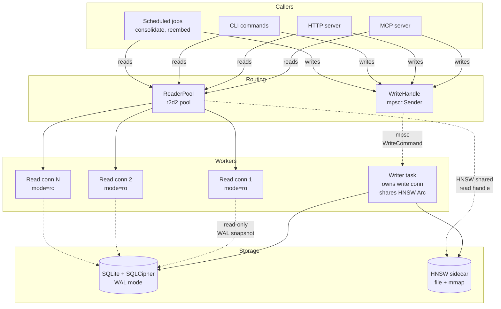
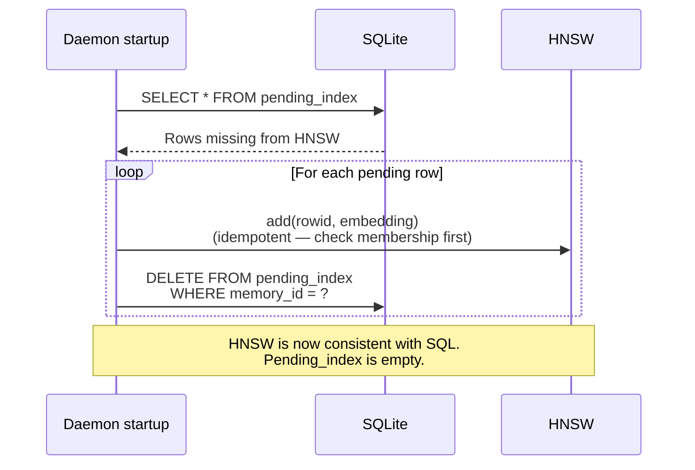

# ADR-0003: Single-writer actor pattern

**Status:** Accepted
**Date:** 2026-05-05 (proposed) · 2026-05-06 (accepted, post pass 9)
**Deciders:** Solo project
**Depends on:** ADR-0001, ADR-0002

## TL;DR

| Concern | Decision |
|---|---|
| Concurrency model | Single-writer actor on dedicated OS thread (`std::thread::spawn`, sync `fn run`, `blocking_recv`) |
| Read path | `deadpool-sqlite` pool, default size 2 |
| HNSW handle | Shared `Arc<dyn VectorIndex + Send + Sync>` between writer and read pool; interior locking via `parking_lot::RwLock` (`hnsw_rs`) |
| Encryption | SQLCipher, raw 32-byte key derived once at startup; per-connection `PRAGMA key = "x'<hex>'"` |
| HNSW + SQL atomicity | Outbox via `pending_index` table; ordering: SQL COMMIT → HNSW.add → reply Ok → drain row |
| HNSW snapshot | 5-min debounced background save + on graceful shutdown |
| Channel | Single mpsc, capacity 1024 |
| Startup | Linear `await` chain in `main()` (key → SQL+migrate+replay → spawn writer → pool → axum) |
| Shutdown | Drop last `WriteHandle` → channel close → actor drains → 30s bounded join |
| Panic | `set_hook` logs + `process::exit(1)`; OS supervisor (systemd/launchd) restarts |
| Deferred to post-v0.1 | Two-channel priority lanes; batched bulk writes via `recv_many` |
| Maintenance | `PRAGMA optimize` hourly; `wal_checkpoint(PASSIVE)` on idle |

The full design and the four research passes that produced it are below. The "Operational invariants" section is the canonical reference for edge-case behavior; the "Final consolidated action items" section is the implementation checklist.

## Context

SQLite is fundamentally a single-writer database — one transaction holds the write lock at a time, even in WAL mode. Solo serves writes from at least four concurrent sources: MCP tool calls (`memory.remember`, `memory.forget`), HTTP API endpoints, CLI subcommands, and scheduled consolidation jobs. We need a concurrency model that:

1. Serializes writes correctly (one writer at any moment, no `SQLITE_BUSY` foreground errors).
2. Allows reads to proceed concurrently with writes (WAL gives us this; the application has to honor it).
3. Keeps the HNSW sidecar in sync with SQLite (mutations to both are part of the same logical transaction).
4. Doesn't degrade under contention — `Arc<Mutex<Connection>>` works correctly but causes priority inversion at scale.

The architecture (`solo-v0-architecture.md §3.1`) calls for a "single-writer actor in Rust, `BEGIN IMMEDIATE` for all writes, `busy_timeout = 5000`," but doesn't pin the concurrency primitive. This ADR pins it before commit 1.1 — `solo init` doesn't need the writer actor, but commit 1.2 (the actor itself) and every subsequent commit do.

## Decision

Use a **dedicated writer task** (on its own OS thread, not on the tokio runtime — see operational invariants O1) that owns the rusqlite write connection. The HNSW handle is held as `Arc<dyn VectorIndex + Send + Sync>` and **shared with the read pool** — same instance, with interior locking provided by `hnsw_rs`'s internal `parking_lot::RwLock`. Other tasks send typed `WriteCommand` enum variants over a `tokio::sync::mpsc::Sender<WriteCommand>` and `await` a `tokio::sync::oneshot::Receiver<Result<Reply>>` for the result.

Reads use a separate **reader pool** of read-only SQLite connections (`?mode=ro`) plus the same `Arc<dyn VectorIndex>`. Many tasks read concurrently; the WAL mode + page-level snapshots make SQL reads safe even while the writer commits, and HNSW search takes the read lock while the writer's `add` takes the write lock.



Sequence for a `remember` call (with R5 outbox pattern; reply happens after HNSW.add but before drain — see operational invariants Q4):

```mermaid
sequenceDiagram
    participant Caller
    participant WH as WriteHandle
    participant Writer as Writer task
    participant DB as SQLite
    participant HNSW

    Caller->>WH: remember(content, ctx)
    WH->>WH: Build WriteCommand::Remember<br/>{ content, ctx, reply: oneshot::Sender }
    WH->>Writer: mpsc.send(cmd)
    Writer->>DB: BEGIN IMMEDIATE
    Writer->>DB: INSERT episodes, FTS5 (via trigger),<br/>vec_episodes, memory_revisions
    Writer->>DB: INSERT INTO pending_index<br/>(memory_id, embedding)
    Writer->>DB: COMMIT
    Note over Writer,DB: SQL is now durable. Crash<br/>after this point still allows recovery.
    Writer->>HNSW: add(rowid, embedding)
    Note over Writer,HNSW: Memory now durable AND searchable.
    Writer->>Caller: oneshot.send(Ok(MemoryId))
    Note over Writer,Caller: Caller continues; cleanup proceeds async.
    Writer->>DB: DELETE FROM pending_index<br/>WHERE memory_id = ?
```

Recovery on daemon startup:



## Trait shapes

This is the canonical sketch incorporating all five audit passes:
- Writer runs on a dedicated OS thread (pass 3 / O1)
- HNSW shared as `Arc<dyn VectorIndex>` between writer and read pool (pass 3 / O2; pass 5)
- `pending_index` outbox written inside the SQL transaction (pass 1 / R5)
- Reply happens after `hnsw.add` succeeds (pass 4)
- Drain happens after reply (pass 4)

```rust
// solo-storage/src/writer.rs

/// All write operations. Each carries a oneshot reply channel.
pub enum WriteCommand {
    Remember {
        episode: solo_core::Episode,
        embedding: solo_core::Embedding,
        reply: tokio::sync::oneshot::Sender<solo_core::Result<solo_core::MemoryId>>,
    },
    Forget {
        memory_id: solo_core::MemoryId,
        reason: String,
        reply: tokio::sync::oneshot::Sender<solo_core::Result<()>>,
    },
    Consolidate {
        scope: ConsolidationScope,
        reply: tokio::sync::oneshot::Sender<solo_core::Result<ConsolidationReport>>,
    },
    Reembed {
        scope: ReembedScope,
        reply: tokio::sync::oneshot::Sender<solo_core::Result<ReembedReport>>,
    },
    SaveSnapshot {
        reply: tokio::sync::oneshot::Sender<solo_core::Result<()>>,
    },
}

/// Cheaply cloneable handle. Hand one to every task that needs to write.
#[derive(Clone)]
pub struct WriteHandle {
    tx: tokio::sync::mpsc::Sender<WriteCommand>,
}

impl WriteHandle {
    pub async fn remember(
        &self,
        episode: solo_core::Episode,
        embedding: solo_core::Embedding,
    ) -> solo_core::Result<solo_core::MemoryId> {
        let (reply_tx, reply_rx) = tokio::sync::oneshot::channel();
        self.tx
            .send(WriteCommand::Remember { episode, embedding, reply: reply_tx })
            .await
            .map_err(|_| solo_core::Error::storage("writer task gone"))?;
        reply_rx
            .await
            .map_err(|_| solo_core::Error::storage("writer dropped reply channel"))?
    }
    // similar methods for forget, consolidate, reembed, save_snapshot.
}

/// The writer actor. Spawned once at daemon startup; owns the write connection
/// for the lifetime of the daemon. The HNSW handle is shared with the read pool
/// via Arc; mutations go through `&self` with internal locking (`hnsw_rs` uses
/// `parking_lot::RwLock` under the hood).
///
/// IMPORTANT: this actor lives on a dedicated OS thread (`std::thread::spawn`),
/// NOT a tokio task — it issues blocking SQLite calls and would starve the
/// runtime if spawned onto it. Inside `run`, channel reads use `blocking_recv`.
pub struct WriterActor {
    conn: rusqlite::Connection,
    hnsw: std::sync::Arc<dyn solo_core::VectorIndex + Send + Sync>,
    rx: tokio::sync::mpsc::Receiver<WriteCommand>,
}

impl WriterActor {
    pub fn spawn(
        conn: rusqlite::Connection,
        hnsw: std::sync::Arc<dyn solo_core::VectorIndex + Send + Sync>,
    ) -> WriteHandle {
        let (tx, rx) = tokio::sync::mpsc::channel(1024);
        let actor = Self { conn, hnsw, rx };
        std::thread::Builder::new()
            .name("solo-writer".into())
            .spawn(move || actor.run())
            .expect("spawn solo-writer thread");
        WriteHandle { tx }
    }

    /// Sync run loop on a dedicated OS thread. `blocking_recv` is correct.
    fn run(mut self) {
        while let Some(cmd) = self.rx.blocking_recv() {
            self.dispatch(cmd);
        }
        self.shutdown();  // flush HNSW snapshot, drain pending_index, checkpoint WAL
    }

    fn dispatch(&mut self, cmd: WriteCommand) {
        match cmd {
            WriteCommand::Remember { episode, embedding, reply } => {
                self.dispatch_remember(episode, embedding, reply);
            }
            WriteCommand::Forget { memory_id, reason, reply } => {
                let _ = reply.send(self.handle_forget(memory_id, reason));
            }
            WriteCommand::SaveSnapshot { reply } => {
                let _ = reply.send(self.handle_save_snapshot());
            }
            // ... Consolidate, Reembed
        }
    }

    fn dispatch_remember(
        &mut self,
        episode: solo_core::Episode,
        embedding: solo_core::Embedding,
        reply: tokio::sync::oneshot::Sender<solo_core::Result<solo_core::MemoryId>>,
    ) {
        // Reply timing rule (operational invariant Q4): reply Ok AFTER hnsw.add
        // but BEFORE the pending_index drain. Caller sees "Ok = durable AND
        // searchable" without waiting on cleanup.
        //
        // Structurally: we cannot return early from a function and then keep
        // doing work. So `handle_remember_durable` produces the result up to
        // and including hnsw.add; we send the reply; then drain happens here.
        let memory_id = episode.memory_id;
        let result = self.handle_remember_durable(episode, embedding);
        let durable_ok = result.is_ok();
        let _ = reply.send(result);

        // Drain happens after reply. If it fails, the row stays in pending_index
        // and gets replayed on next startup — same outcome as crashing here.
        if durable_ok {
            if let Err(e) = self.conn.execute(
                "DELETE FROM pending_index WHERE memory_id = ?",
                [&memory_id.to_string()],
            ) {
                tracing::warn!(?e, %memory_id, "pending_index drain failed; will replay on next startup");
            }
        }
    }

    fn handle_remember_durable(
        &mut self,
        episode: solo_core::Episode,
        embedding: solo_core::Embedding,
    ) -> solo_core::Result<solo_core::MemoryId> {
        let memory_id = episode.memory_id; // MemoryId: Copy
        // Step 1 — SQL transaction: episode row, FTS5 (via trigger), vec_episodes,
        // memory_revisions, AND pending_index — all in one tx so durability and
        // outbox-row-presence are atomic.
        let tx = self.conn.transaction_with_behavior(
            rusqlite::TransactionBehavior::Immediate,
        )?;
        // ... INSERT episode, INSERT pending_index { memory_id, embedding, ... } ...
        tx.commit()?;

        // Step 2 — SQL is now durable. Add to HNSW. `&self` works because
        // hnsw_rs's `pub fn insert(&self, ...)` uses interior parking_lot
        // RwLock for layer access.
        let f32_slice = embedding.as_f32_slice()
            .ok_or_else(|| solo_core::Error::embedder("HNSW expects F32 embeddings; convert dtype upstream"))?;
        self.hnsw.add(rowid, f32_slice)?;

        Ok(memory_id)
    }

    fn shutdown(&mut self) {
        // On graceful shutdown (channel closed by last WriteHandle drop):
        //   1. Save HNSW snapshot atomically (write .tmp, fsync, rename, keep .bak).
        //   2. Drain remaining pending_index rows after re-adding to HNSW.
        //   3. PRAGMA wal_checkpoint(TRUNCATE) to flush WAL fully.
        //   4. Drop connection (closes file).
    }
}
```

```rust
// solo-storage/src/reader.rs
// Updated per R1: deadpool-sqlite (async-native) instead of r2d2.

/// A pool of read-only SQLite connections. Use for any read path.
pub struct ReaderPool {
    pool: deadpool_sqlite::Pool,
    hnsw: std::sync::Arc<dyn solo_core::VectorIndex + Send + Sync>,
}

impl ReaderPool {
    pub fn new(
        db_path: &std::path::Path,
        key: &KeyMaterial,                // raw 32-byte key per R2
        size: usize,
        hnsw: std::sync::Arc<dyn solo_core::VectorIndex + Send + Sync>,
    ) -> solo_core::Result<Self> {
        let cfg = deadpool_sqlite::Config::new(db_path);
        // OpenFlags: read-only, no mutex (deadpool serializes per-connection)
        let mut pool_cfg = cfg.builder(deadpool_sqlite::Runtime::Tokio1)
            .map_err(|e| solo_core::Error::storage(e.to_string()))?
            .max_size(size);
        // Per-connection init: bind raw key (no PBKDF2 cost per connection)
        let key_hex = hex::encode(key.as_bytes());
        let pool = pool_cfg
            .post_create(move |conn: &mut rusqlite::Connection, _| {
                conn.pragma_update(None, "key", &format!("x'{key_hex}'"))
            })
            .build()
            .map_err(|e| solo_core::Error::storage(e.to_string()))?;
        Ok(Self { pool, hnsw })
    }

    /// Async acquire — runs on the pool's worker thread.
    pub async fn interact<F, R>(&self, f: F) -> solo_core::Result<R>
    where
        F: FnOnce(&rusqlite::Connection) -> rusqlite::Result<R> + Send + 'static,
        R: Send + 'static,
    {
        let conn = self.pool.get().await
            .map_err(|e| solo_core::Error::storage(e.to_string()))?;
        let result = conn.interact(f).await
            .map_err(|e| solo_core::Error::storage(e.to_string()))?
            .map_err(|e| solo_core::Error::storage(e.to_string()))?;
        Ok(result)
    }
}
```

## Options Considered

### Option A: `Arc<Mutex<Connection>>`

Wrap one SQLite connection in `Arc<tokio::sync::Mutex<...>>`; every caller takes the lock for both reads and writes.

**Pros:** Simplest to write; no command/reply types; one connection.
**Cons:** Reads serialize with writes, defeating WAL's concurrent-read advantage. Lock fairness becomes a real issue under load — long writes (consolidation) starve short reads. Adding the HNSW sidecar muddies the lock further. Hard to reason about which task currently holds the lock when debugging.

### Option B: r2d2 pool with one writer connection

Use a single r2d2 pool of size N+1; designate one connection as "the writer" by convention. Reads pull any non-writer connection.

**Pros:** Familiar pattern. Pool handles lifecycle.
**Cons:** Convention-based, not enforced — easy for code to write through a "read" connection by mistake. The HNSW sidecar still needs separate locking. Doesn't compose cleanly with `tokio` async — r2d2 is sync-API.

### Option C: Single-writer actor + reader pool (recommended)

As described above. Writer task owns the write connection AND the HNSW mut handle; readers use a separate pool.

**Pros:** Type system enforces the contract — there's no `&mut Connection` outside the actor, period. Reads scale freely under WAL. HNSW sidecar mutations naturally serialize with SQL writes (same actor). Writer-task drop = clean shutdown signal.
**Cons:** One extra layer of indirection (mpsc + oneshot per write). Each write does ~2 channel sends and one channel receive — measured at ~5-10 µs of overhead in tokio benchmarks, invisible against the 1-5 ms write latency budget. New write operations require a `WriteCommand` variant and a `WriteHandle` method.

### Option D: deadpool / bb8 instead of r2d2

Async-first connection pools.

**Pros:** Native async API, no `spawn_blocking` calls.
**Cons:** Rusqlite's underlying SQLite calls are blocking C functions — async pool doesn't change that, the blocking happens inside the connection. The async API is mostly cosmetic. r2d2 is more mature, has better community-tested SQLCipher integration.

## Trade-off Analysis

The pivot is **whether the type system should enforce the writer-vs-reader split**. With `Arc<Mutex<Connection>>` (Option A) or a free-for-all pool (Option B), nothing stops a developer from issuing writes through a read connection or forgetting to lock for HNSW mutations. With the actor pattern, *the only way to write is to send a `WriteCommand`*. The compiler enforces it.

The HNSW sidecar tilts this further. It's a separate file, with its own mutability rules, and its updates must be in the same logical transaction as the SQL write. The actor pattern makes that natural — both lives end together, both mutate together. Any other pattern requires manual coordination (locks, semaphores) and introduces a new class of bug ("HNSW updated, SQL didn't commit, restart shows them out of sync").

The cost — one channel round-trip per write — is invisible at Solo's expected throughput (10s of writes/sec for the typical user). Even at 1000 writes/sec the overhead is 1% of CPU.

## Consequences

**What becomes easier:**

- New write operation = add `WriteCommand` variant + `WriteHandle` method + `dispatch` arm. Deterministic to implement.
- Writer-task panic = single point of failure with a single recovery strategy (log, alert, restart).
- HNSW sidecar atomicity is automatic — both writes are inside the same actor invocation.
- Testing the writer is straightforward: spawn the actor, send commands, await replies.
- Graceful shutdown: drop the `WriteHandle`, the actor sees `None` from `recv()`, exits cleanly, the connection's `Drop` runs.

**What becomes harder:**

- Read-modify-write across a single transaction needs a new `WriteCommand` variant rather than ad-hoc transactional code at the call site. (Defensible — those operations are exactly the ones that benefit from being explicit and named.)
- Backpressure: if the channel fills (1024 capacity), `WriteHandle::remember` async-blocks. Need to monitor channel depth in production.

**What we'll need to revisit:**

- If write throughput becomes a real bottleneck (10K+ writes/sec sustained), revisit the single-writer constraint — libSQL's experimental concurrent-writer mode is the migration path mentioned in `solo-v0-architecture.md` Risk 5.
- Community owns exactly one database and therefore exactly one writer actor.

## Research update (2026-05-05)

A research pass over 2025-2026 Rust + SQLite production practice surfaced five refinements and one disqualified alternative. Original Option C stands; details below tighten it.

### Findings that strengthen Option C

**The ecosystem has converged on this pattern.** `sqlx-sqlite` implements it internally — every connection runs on a dedicated OS thread that receives async commands over a channel. `tokio-rusqlite` (programatik29/tokio-rusqlite, ~500 stars) implements it explicitly as a thin wrapper around rusqlite. The pattern isn't custom; it's the de facto community answer.

**Option E (`spawn_blocking` per call) is no longer idiomatic.** Tokio team guidance (Alice Rhyl, 2023-2024) plus sqlx's explicit choice not to use it: per-call `spawn_blocking` for hot paths exhausts the 512-thread default pool under burst, has no ordering guarantees (multiple `BEGIN IMMEDIATE` calls randomly serialize through SQLite's lock, returning `SQLITE_BUSY`), and confuses connection lifecycle. Acceptable for occasional one-shot tasks; not for our write path. Removed from the alternatives.

### Refinements to Option C

**R1 — Switch the read pool from `r2d2` to `deadpool-sqlite`.** r2d2 is a sync API; using it from tokio requires `spawn_blocking` to acquire a connection, which inherits Option E's problems on the read path. `deadpool-sqlite` is async-native, mature through 2025, and uses worker-thread-per-connection internally — same model as sqlx. Workspace dep change: `deadpool-sqlite = "0.10"` instead of `r2d2 = "0.8"` + `r2d2_sqlite = "0.25"`.

**R2 — SQLCipher raw-key handling is mandatory.** Default SQLCipher v4 uses 256,000 PBKDF2-HMAC-SHA512 iterations per connection open. On a modern laptop that's 80-150 ms per cold connection (worse on ARM). A pool that lazily opens new connections would stall the daemon on every refill. Mitigation: derive the key *once* at daemon startup using the user passphrase + salt, then pass the raw 32-byte key to every connection via `PRAGMA key = "x'<hex>'"` (raw-key syntax bypasses derivation). Per-connection cost drops to 1-5 ms. This applies to both the writer connection (opened once at startup) and every read pool connection. Implementation: a `KeyMaterial` struct holding the raw key, threaded through `WriterActor::spawn` and `ReaderPool::new`.

**R3 — Two-channel priority pattern.** Single-channel design has a real failure mode: a nightly consolidation burst (1000+ writes) backs up the channel, blocking interactive `memory.remember` calls behind it. The fix is two channels — interactive writes via `mpsc<UrgentCommand>(64)`, consolidation via `mpsc<BulkCommand>(1024)`. Actor uses `tokio::select! { biased; urgent => ..., bulk => ... }` so urgent always drains first. Cost is one extra channel and an enum split; benefit is interactive write latency stays bounded under any consolidation load.

**R4 — Actor-side batching for bulk commands.** When the actor receives a bulk command, drain up to N (e.g., 256) more bulk commands non-blockingly via `try_recv`, execute the whole batch as one transaction. One WAL append + one fsync instead of N. For our consolidation workload this is the difference between 1000 fsyncs/sec (saturating disk) and 4 fsyncs/sec (invisible).

**R5 — Explicit HNSW recovery, not implicit.** I previously argued the actor pattern made SQL+HNSW atomicity automatic. **It doesn't.** Even inside one `dispatch` invocation, SQL `COMMIT` returns before the HNSW `add` completes. A crash in that window loses the HNSW update. The architecture's "HNSW sidecar is a cache, not source-of-truth" (`solo-v0-architecture.md §3.2`) needs to be honored explicitly: add a `pending_index` table populated as part of the SQL transaction, drained by the actor *after* HNSW write succeeds. On startup, the daemon checks `pending_index` and replays missing HNSW entries from the SQL row. Zero extra work in the happy path; correct recovery on crash.

### Numbers worth noting

- **mpsc + oneshot round-trip:** 1-3 µs uncontended, 5-15 µs under load. Our 5-10 µs estimate was right. <1% of the 1-5 ms write budget.
- **deadpool-sqlite pool acquire:** ~10-50 µs warm.
- **SQLCipher per-page encrypt overhead:** 5-15% vs plain WAL. Acceptable.
- **WAL checkpoint stall on large WAL:** can be hundreds of ms. Mitigation: keep `PRAGMA wal_autocheckpoint = 1000` (default) and trigger `PRAGMA wal_checkpoint(PASSIVE)` during idle from the actor's idle path.

## Second research pass (2026-05-05 PM)

A focused verification of R1-R5 against 2024-2026 production evidence, plus a formal evaluation of Option F. Findings:

**R1 confirmed.** `deadpool-sqlite` 0.8/0.9 tracked rusqlite 0.31/0.32 through 2024-2025 with active maintenance. r2d2_sqlite still has happy production users in sync contexts but using it from tokio requires manual `spawn_blocking` — exactly what deadpool wraps for you. Switch holds.

**R2 confirmed.** SQLCipher 4.x default is 256,000 PBKDF2-HMAC-SHA512 iterations costing 80-150 ms on 2023-era laptops (Zetetic's own design discussion). The raw-key syntax `PRAGMA key = "x'<64-hex>'";` is officially documented at zetetic.net/sqlcipher/sqlcipher-api/#key and stable across SQLCipher 3.x and 4.x. Important note: the salt remains — even with raw key, SQLCipher uses the per-database salt stored in the first 16 file bytes for HMAC subkey derivation. Threat model is unchanged: per Zetetic, SQLCipher defends "data at rest"; raw key vs passphrase in process memory is materially equivalent under that threat model. Keep.

**R3 modified — defer to post-v0.1.** `tokio::select! { biased; }` works as described — first ready arm wins deterministically (docs.rs/tokio macro.select.html). Starvation is real but a non-issue for our workload (urgent ~10/s interactive vs bulk ~1000/s during nightly consolidation when interactive is idle). The pattern is canonical: ractor and kameo both use single mailboxes and document priority via two-channel + select. **The cost-benefit analysis for v0:** at 10 writes/sec interactive load, single mpsc handles every request in <1 ms of actor time. The 1000/s nightly burst is the only workload that benefits from priority, and during that burst the urgent lane has nothing to serve. **R3's value at v0.1 is essentially zero.** Defer; ship single mpsc.

**R4 modified — defer to post-v0.1, AND use `recv_many` not try_recv.** Tokio 1.37 (April 2024) stabilized `Receiver::recv_many(&mut self, buffer: &mut Vec<T>, limit: usize)` — the right primitive for "drain N or block for one." Cleaner than the try_recv loop I had. SQLite transaction limits are not a concern (default page count limit is ~1.07 billion). **Defer rationale:** at 1000 writes/sec × 1 hour of nightly consolidation = 3.6M writes/night, plenty of headroom either way. Cost of deferring: ~1 day to add later. Cost of shipping now: ~150 lines of select! + drain logic plus shutdown edge cases. Ship single per-command transactions in v0.1; add batching when measurement shows need.

**R5 confirmed, with explicit ordering rule.** Outbox pattern is textbook (Pat Helland's "Life Beyond Distributed Transactions"; Chris Richardson microservices.io/patterns/data/transactional-outbox.html). Rebuild-on-startup alternative measured at 200-1000 sec for 1M vectors — unacceptable for an MCP daemon. **Required ordering** (must be documented in the implementation): inside the actor's dispatch, after SQL `COMMIT` returns, the order is `HNSW.add(...)` → `DELETE FROM pending_index WHERE memory_id = ?`. Reverse order would leave the row drained but the vector missing — silent data loss. Replay on startup must check HNSW membership first to be idempotent against duplicate inserts.

**Option F (Atuin pattern, app-level encryption) — rejected on a hard technical basis.** Atuin (atuin.sh) uses sqlx + per-record XChaCha20-Poly1305 with no SQLCipher. Drastically simpler build chain (no Perl, no OpenSSL). The leak surface in this pattern: schema, table names, FTS tokens, timestamps, and embedding vectors all visible in the file. **The dealbreaker is embedding inversion attacks.** Morris et al., "Text Embeddings Reveal (Almost) As Much As Text" (EMNLP 2023, arxiv.org/abs/2310.06816), demonstrate 92%+ recovery of 32-token inputs from embeddings of popular models (ada, sentence-transformers); the `vec2text` tooling is publicly available; 2024 follow-up extended the work to longer passages. For Solo's stated personas (lawyers, therapists, journalists, founders facing device theft), leaking embeddings ≈ leaking content. SQLCipher's full-file encryption is correct precisely because embeddings are content-equivalent. Build pain is worth it. Reject.

## Final action items

### Ship in commit 1.2 (v0.1.0)

1. [ ] Add `deadpool-sqlite = "0.10"` and `hex = "0.4"` to `[workspace.dependencies]`. Remove the previously-planned `r2d2` / `r2d2_sqlite`.
2. [ ] Create `crates/solo-storage/src/key_material.rs` — `KeyMaterial` struct holding the raw 32-byte SQLCipher key. Derived once from user passphrase via Argon2id at daemon startup; never re-derived. Zeroize on drop.
3. [ ] Create `crates/solo-storage/src/writer.rs` — single-channel actor:
   - `WriteCommand` enum (initially: `Remember`, `Forget`, `Consolidate`, `Reembed`).
   - `WriteHandle { tx: mpsc::Sender<WriteCommand> }` cheap-cloneable struct.
   - `WriterActor` struct + `spawn` + `run` + per-command `dispatch` methods.
   - Inside dispatch: SQL transaction → SQL COMMIT → HNSW.add → DELETE from pending_index.
4. [ ] Create `crates/solo-storage/src/reader.rs` — `ReaderPool` wrapping `deadpool_sqlite::Pool`. Pool size default 4. Per-connection `post_create` hook binds raw key via `PRAGMA key = "x'<hex>'"`.
5. [ ] Add `pending_index` table to the schema migration in commit 1.1.
6. [ ] Implement startup recovery: on `solo daemon` start, replay `pending_index` rows into HNSW (idempotent — check membership first), then drain.
7. [ ] Document concurrency invariants at top of `solo-storage/src/lib.rs`: "writes go through `WriteHandle`; reads go through `ReaderPool`; writer connection opens once and never recycles; read pool binds raw key on every new connection; `pending_index` ordering is HNSW.add → drain row, never reverse."
8. [ ] Property test: 1000 concurrent reads + 100 writes + 5000-row consolidation burst all complete without `SQLITE_BUSY`.
9. [ ] Property test: kill -9 the daemon between SQL commit and HNSW write (or between HNSW write and pending_index drain); verify on restart that recovery replays correctly and the HNSW vector count matches `SELECT COUNT(*) FROM episodes WHERE tier = 'hot'`.

### Defer to post-v0.1.0 (add when measurement shows need)

- [ ] Two-channel priority pattern (R3). Trigger: any p99 interactive write latency exceeding 50 ms during consolidation in production telemetry.
- [ ] Actor-side batching of bulk writes via `tokio::sync::mpsc::Receiver::recv_many` (R4). Trigger: nightly consolidation taking longer than ~30 minutes for typical user workloads.

Both are clean drop-in additions later — the actor structure makes them trivial. No design decision today blocks adding them.

## Third research pass (2026-05-05 evening) — operational details

The first two passes settled the architecture; this pass settled the operational details. Six adjustments, one of which catches a real bug in the prior code example.

**O1 — Writer runs on a dedicated OS thread, not a tokio task. (BUG FIX)**

The prior `Trait shapes` code section showed `tokio::spawn(actor.run())` with `async fn run`. That's wrong: blocking SQLite calls inside a tokio task starve the runtime under load. Both reference implementations use `std::thread::spawn`:

- **sqlx-sqlite** spawns dedicated threads per connection ([sqlx#793](https://github.com/launchbadge/sqlx/issues/793))
- **tokio-rusqlite** uses `std::thread::spawn` per connection ([crate](https://docs.rs/tokio-rusqlite/))
- **Tokio team guidance** ([tokio#3868](https://github.com/tokio-rs/tokio/discussions/3868)): for "actor that owns blocking resource," dedicated thread + `Receiver::blocking_recv()` is the canonical pattern.

Corrected sketch:

```rust
impl WriterActor {
    pub fn spawn(conn: rusqlite::Connection, hnsw: ...) -> WriteHandle {
        let (tx, rx) = mpsc::channel(1024);
        let actor = Self { conn, hnsw, rx };
        std::thread::Builder::new()
            .name("solo-writer".into())
            .spawn(move || actor.run())  // dedicated OS thread; NOT tokio::spawn
            .expect("spawn writer thread");
        WriteHandle { tx }
    }

    fn run(mut self) {
        // Sync code on its own OS thread.
        while let Some(cmd) = self.rx.blocking_recv() {
            self.dispatch(cmd);
        }
        self.shutdown();  // flush HNSW, drain pending_index, checkpoint WAL
    }
}
```

`tokio::task::spawn_blocking` is *not* the right alternative — its blocking pool (default 512 threads) is intended for one-shot work; a permanent occupant wastes a slot for the daemon's lifetime and silently shrinks the pool on panic. `std::thread::spawn` gives a real `JoinHandle`, observable panics, and clean shutdown semantics.

**O2 — `hnsw_rs` concurrency: share `Arc<Hnsw>` with read pool, no extra lock.**

`hnsw_rs` is `Send + Sync`; internally it uses `Arc<RwLock<...>>` from parking_lot ([crate](https://github.com/jean-pierreBoth/hnswlib-rs)). Search takes read locks; insert takes write locks. The writer holds the only mutating reference; the read pool holds `Arc<Hnsw>` and calls `search()` from many threads concurrently. Brief contention during inserts is invisible at our load. **Do not wrap in an application-level Mutex/RwLock — `hnsw_rs` already has one internally; double-locking buys nothing.**

**O3 — HNSW snapshot policy: every 5 minutes, debounced, plus on shutdown.**

The architecture doc's §3.2 mentions "atomic-rename on save" but didn't specify when. Production patterns vary: Weaviate snapshots on time-and-commit thresholds; Qdrant relies on a WAL. Solo's `pending_index` already covers data loss on crash — the HNSW snapshot's only job is bounding *recovery time*, not preventing data loss.

Policy:

- Background tokio task wakes every 5 minutes.
- If the writer's mpsc has been empty for the last 5 minutes AND no insert happened since the last save, skip.
- Otherwise, signal the writer with `WriteCommand::SaveSnapshot { reply }`. The writer calls `hnsw.file_dump("hnsw_episodes.bin.tmp")`, `fsync`s, atomically renames over `hnsw_episodes.bin`, keeps `.bak`.
- Always save on graceful shutdown.

At 10 writes/sec interactive, max 3000 vectors to replay from `pending_index` on crash → ~3 sec recovery time at hnsw_rs's ~1 ms insert rate. Within budget.

**O4 — Recall path: one `pool.get()` + one `interact` per query.**

Each `pool.get().await.interact(...).await` round-trips through deadpool's worker thread for ~15-50 µs ([deadpool docs](https://docs.rs/deadpool-sqlite/)). The recall path runs HNSW search + SQL fetch + BM25 rerank — three small queries. **Hold the connection across all three** by bundling the work into a single `interact` closure. Use `prepare_cached` inside for prepared-statement reuse.

```rust
let conn = pool.get().await?;
let result = conn.interact(move |c| {
    let rows = c.prepare_cached("SELECT ... WHERE rowid IN (?,?,...)")?
        .query_map(params, ...)?;
    let bm25 = c.prepare_cached("SELECT bm25(fts) WHERE ... ")?
        .query_map(...)?;
    Ok(merge_with_rrf(rows, bm25))
}).await??;
```

One thread-hop instead of three; saves ~50-100 µs per recall.

**O5 — Long-running writer connection is safe; add two maintenance pragmas.**

rusqlite's `Connection` is designed for process-lifetime use ([rusqlite#1226](https://github.com/rusqlite/rusqlite/discussions/1226)); SQLite "will never leak memory as long as the application cooperates" (sqlite forum). No recycling needed. Add to the writer's idle path:

- `PRAGMA optimize` every hour (refreshes stat tables — SQLite's own recommendation for long-lived connections).
- `PRAGMA wal_checkpoint(PASSIVE)` when the mpsc has been empty for 5 seconds (prevents unbounded WAL growth under sustained writes).

**O6 — Startup ordering: linear `await` chain in `main()`, no separate ready signal.**

Axum has no built-in readiness signal ([axum#3318](https://github.com/tokio-rs/axum/issues/3318)). Pattern:

```rust
let key = derive_key(passphrase).await?;
let writer_handle = open_db_and_spawn_writer(key.clone()).await?;
//   ↑ inside this: open SQLite, run migrations, load HNSW from disk,
//     replay pending_index, spawn writer thread, return handle
let read_pool = build_read_pool(key.clone(), 2).await?;  // size 2 per O9
let app = build_axum_app(writer_handle, read_pool);
axum::serve(listener, app)
    .with_graceful_shutdown(shutdown_signal())
    .await?;
```

The "system is ready" point is implicit when `axum::serve` accepts. Defer any external readiness signal to v0.2.

**O7 — Shutdown: drop the last `WriteHandle`, mpsc closes, actor exits cleanly.**

Pattern from [tokio Graceful Shutdown topic](https://tokio.rs/tokio/topics/shutdown):

1. `tokio::signal::ctrl_c()` (and `tokio::signal::unix::SIGTERM`) → fires shutdown.
2. `axum::serve(...).with_graceful_shutdown(shutdown_signal())` → axum stops accepting, drains in-flight handlers.
3. After axum drains, drop the last `WriteHandle`. Sender refcount → 0; `rx.blocking_recv()` returns `None`; actor falls through its loop.
4. Actor's `shutdown()` runs: `hnsw.file_dump()`, drain `pending_index`, `PRAGMA wal_checkpoint(TRUNCATE)`, drop `Connection`.
5. `actor_thread.join()` from `main()` with a 30-sec timeout. Force-exit if exceeded.

**O8 — Panic recovery: log + exit + OS supervisor restart. Never in-process.**

If the writer panics (DB corruption, OOM, invariant violation), in-process recovery is unsafe — `deadpool-sqlite` issue [#113](https://github.com/deadpool-rs/deadpool/issues/113) documents panic-poisoned connections; rusqlite holds a `RefCell` so a panic mid-borrow leaves state unsafe. The right posture is:

1. `std::panic::set_hook` logs panic + calls `process::exit(1)`.
2. `tokio::runtime::Builder::unhandled_panic(UnhandledPanic::ShutdownRuntime)` catches panics on tokio tasks.
3. Document: "Solo must run under a supervisor (systemd, launchd, or `exec` from a shell wrapper). The daemon is designed to fail fast and let the supervisor restart it." Same posture as Erlang OTP "let it crash" — but the supervisor is the OS, not another tokio task.

**O9 — Read pool default size: 2, not 4.**

At 10 reads/sec single user, four connections is overkill. Two gives parallelism for the brief windows when two recalls overlap. Tunable via config; default 2.

## Operational invariants

These are the load-bearing edge-case behaviors implementers must honor. They were under-specified through the first three research passes and got pinned during the fourth-pass audit.

### Channel capacity (1024 default)

Sized for the `consolidate` worst case: ~1 sec of 1000-write burst at the queue tail. Backpressure semantics on overflow: `WriteHandle::send().await` blocks the caller until space frees — correct backpressure, no drops. If telemetry shows callers blocking on `send` for sustained > 100 ms, raise the capacity. Lower bound is 64 (one second of interactive load with safety margin); the tuning surface is small.

### WriteCommand reply timing semantics

The user-visible meaning of `Ok(...)` from each command must be unambiguous. Per-variant rules:

| Command | Reply Ok means |
|---|---|
| `Remember` | SQL committed AND HNSW vector added. The memory is durable AND searchable. (Reply happens after `hnsw.add` succeeds, BEFORE the `pending_index` drain — drain is cleanup, not part of the durability guarantee.) |
| `Forget` | SQL row's `status='forgotten'` is committed. HNSW vector is NOT removed (architecture preserves silent traces); recall paths exclude `status='forgotten'` rows by SQL filter. |
| `Consolidate` | The entire consolidation pass completed (could be seconds-to-minutes). Caller may want a `Streaming` variant later that emits progress events; defer. |
| `Reembed` | The entire job completed (could be minutes). Internal chunking via `ChunkedJob`; resumable across crashes via the `chunked_job_progress` table. |
| `SaveSnapshot` | `hnsw.file_dump` + atomic rename succeeded. Reply Err if disk write failed; daemon continues (snapshot is a cache, not source of truth). |

Caller code patterns assume "Ok = durable + visible to subsequent recalls."

### Startup file-existence decision tree

At daemon start, after key derivation but before spawning the writer thread:

```
solo.db missing
    → first run: create file, run all migrations, empty HNSW, no pending_index. Continue.

solo.db exists + hnsw_episodes.bin loads cleanly
    → use it. Replay pending_index. Continue.

solo.db exists + hnsw_episodes.bin missing or corrupt + hnsw_episodes.bin.bak loads cleanly
    → use the .bak (atomic rename was interrupted last session). Log a warning. Replay pending_index.

solo.db exists + both .bin and .bak fail to load + episodes table is empty
    → fresh empty HNSW. Continue.

solo.db exists + both .bin and .bak fail + episodes table has N rows
    → rebuild HNSW from episodes (slow: ~1 ms per vector at hnsw_rs's insert rate).
    → at 1M rows this is 15-20 min — surface a progress message to stderr; emit a metric.
    → after rebuild, replay pending_index.
```

The rebuild path is the slow corner. Document it in BUILDING.md as a known cold-start cost when snapshot files are lost. Subsequent starts use the freshly-saved snapshot.

### Snapshot save failure handling

`hnsw.file_dump()` can fail on disk full, permission error, or IO timeout. Writer behavior on failure:

1. Log the error with full path and `errno`-equivalent context.
2. Reply `Err(...)` to whichever caller initiated the snapshot (the background timer task or `solo daemon --save-snapshot`).
3. Continue serving writes — the snapshot is a cache, not durable storage.
4. Emit a `solo_hnsw_snapshot_failures_total` metric.
5. After 3 consecutive failures across 15 minutes, log at WARN level (operator should investigate).

Never crash on snapshot failure. The `pending_index` table preserves recovery state regardless.

### SaveSnapshot competes with writes

The 5-min background timer task sends `WriteCommand::SaveSnapshot` over the same mpsc the regular writes use. During a write burst, SaveSnapshot waits its turn — worst case ~1 sec delay during a 1000-write consolidation burst. Acceptable: snapshot cadence has 5-min slack. If a snapshot is delayed by more than 2× the cadence (10 min), the background task logs a warning. If telemetry ever shows sustained delay, the fix is to defer R3 (priority channels) — `SaveSnapshot` can ride the urgent lane.

### Reads during replay

The startup chain in `main()` runs `pending_index` replay synchronously before `axum::serve(...)` binds the listener. No reads can arrive during replay — confirmed safe by linear `await` ordering. (If we ever expose a metrics endpoint that binds before recovery, the daemon must signal "not ready" via a 503 response until recovery completes.)

### `pending_index` idempotency on replay

During replay, for each row in `pending_index`:

1. Call `hnsw.search_exact_id(rowid)` (or equivalent membership check). If the vector is already present (e.g., HNSW snapshot was saved after the SQL commit but before the drain succeeded), skip the add.
2. Otherwise, `hnsw.add(rowid, embedding)`.
3. Drain the row: `DELETE FROM pending_index WHERE memory_id = ?`.

Replay completes when `pending_index` is empty. Step 1's membership check is what makes the replay path safe to re-run on a daemon that crashed mid-replay.

### `pending_index` table schema (reference for commit 1.1)

```sql
CREATE TABLE pending_index (
  memory_id    TEXT PRIMARY KEY REFERENCES episodes(memory_id) ON DELETE CASCADE,
  embedding    BLOB NOT NULL,            -- raw vector bytes; dtype implicit per Embedder
  embedding_dim INTEGER NOT NULL,        -- guards against schema drift across versions
  enqueued_at  INTEGER NOT NULL          -- epoch ms; for diagnostics + alert metrics
);
CREATE INDEX idx_pending_enqueued ON pending_index(enqueued_at);
```

The CASCADE handles the rare case where a row is deleted from `episodes` (e.g., a hard-delete during a future migration) while still pending — the corresponding pending row is removed automatically.

### VectorIndex reference semantics (Arc-shared, interior mutability)

Both the writer thread and the read pool hold `Arc<dyn VectorIndex + Send + Sync>` pointing at the **same instance**. Mutations (`add`, `remove`) take `&self`; implementations handle concurrency internally (e.g., `hnsw_rs` via `parking_lot::RwLock`). The discipline that keeps this safe is that **only the writer thread issues mutations**; read tasks only call `search`. The trait does not enforce this; the daemon's structure does (mutations only flow through `WriteCommand`).

**Amendment to ADR-0002:** the original `VectorIndex` trait declared `add(&mut self, ...)` and `remove(&mut self, ...)`. After this audit, both must be `&self` with internal locking, to support the shared `Arc<dyn VectorIndex>` pattern that O2 requires. Filed as the first item in "Architecture-doc errata flagged for fix."

### Migration vs. writer-thread connection lifecycle

The startup chain in `main()` opens **a temporary connection** to run schema migrations (and perform path-validation refusal of cloud-sync folders, salt-init for a brand-new database, and replay of `pending_index` if an HNSW snapshot was loaded before this point). That connection is closed when migration + replay completes. **The WriterActor opens its own long-lived connection on its dedicated thread** — this avoids handing a partially-initialized connection across thread boundaries and gives the actor a clean state machine. The startup cost of opening a second SQLite connection with the raw key is ~1-5 ms (per O5/R2); negligible.

---

### Operational invariant: shared HNSW namespace across episodes and document chunks (v0.7.0)

(Added in v0.7.0 when document chunks began sharing the HNSW index.)

The writer-actor and reader-side query modules share a single HNSW vector
index across episodes and document chunks. SQLite AUTOINCREMENT is per-
table, so `episodes.rowid` and `document_chunks.rowid` can both equal `1`
(or any other value). To prevent collision, the HNSW id is computed from
the rowid + a kind discriminator:

- `episode_hnsw_id(rowid) = rowid`                  (high bit clear)
- `chunk_hnsw_id(rowid)   = rowid | (1 << 62)`      (high bit set)

All writer add/remove paths apply the encoding. All reader search paths
decode returned ids to determine kind, then strip the high bit before
joining against the canonical table (`episodes` or `document_chunks`).
This invariant is enforced by:

- `solo_storage::hnsw_id::{episode_hnsw_id, chunk_hnsw_id, decode_hnsw_id}`
- Test `episode_and_chunk_with_same_rowid_coexist_in_hnsw` in `writer.rs`
- Recovery replay using `pending_index.kind` discriminator + correct encoding

Empirical motivation: `hnsw_rs` 0.3.4 silently accepts duplicate `origin_id`
inserts (see `vector_index::tests::hnsw_rs_accepts_duplicate_origin_id_silently`).
Without encoding, an episode + chunk at `rowid=1` would land as two
distinct internal points both tagged `external_id=1`, and `search` would
return ambiguous duplicates the downstream SQL JOIN couldn't disambiguate.
The encoding is library-behavior-independent — even if a future `hnsw_rs`
release changes duplicate semantics, the encoded namespace is collision-
free by construction.

## Final consolidated action items (after four passes)

### Ship in commit 1.2 (v0.1.0)

1. [ ] Add `deadpool-sqlite = "0.13"`, `hex = "0.4"`, `zeroize = "1.8"`, `argon2 = "0.5"` (already present), `getrandom = "0.2"` to `[workspace.dependencies]`. Remove `r2d2` / `r2d2_sqlite`.
2. [ ] Create `crates/solo-storage/src/key_material.rs` — `KeyMaterial` struct holding the raw 32-byte SQLCipher key. Derived once from user passphrase via Argon2id at daemon startup; never re-derived. Zeroize on drop.
3. [ ] Create `crates/solo-storage/src/writer.rs` — single-channel actor on a **dedicated OS thread**:
   - `WriteCommand` enum (initially: `Remember`, `Forget`, `Consolidate`, `Reembed`, `SaveSnapshot`).
   - `WriteHandle { tx: mpsc::Sender<WriteCommand> }` cheap-cloneable struct (`#[derive(Clone)]`).
   - `WriterActor { conn, hnsw: Arc<dyn VectorIndex + Send + Sync>, rx }`. `spawn` uses `std::thread::Builder::new().name("solo-writer").spawn(...)`.
   - `fn run(self)` (sync, NOT async). Uses `rx.blocking_recv()`.
   - Inside `handle_remember`: SQL transaction (with pending_index INSERT) → SQL COMMIT → `self.hnsw.add(...)` → reply `Ok(MemoryId)` → `DELETE FROM pending_index`. The reply happens *before* drain so the caller doesn't wait for cleanup; drain ordering is a system invariant, never reverse.
   - `shutdown()` flushes HNSW snapshot, drains remaining pending_index, runs `wal_checkpoint(TRUNCATE)`.
4. [ ] Create `crates/solo-storage/src/reader.rs` — `ReaderPool` wrapping `deadpool_sqlite::Pool`. **Default size 2.** `post_create` hook binds raw key via `PRAGMA key = "x'<hex>'"`. Read API holds connection across the multi-query recall path inside one `interact` closure.
5. [ ] HNSW shared as `Arc<Hnsw>`; read pool searches without application-level lock (`hnsw_rs` has internal RwLock).
6. [ ] Add `pending_index` table to schema migration (commit 1.1).
7. [ ] Implement startup recovery: on `solo daemon` start, after migrations and HNSW load, replay `pending_index` rows into HNSW (idempotent — check membership first), then drain.
8. [ ] Background snapshot task: tokio task, every 5 minutes, debounced. Sends `SaveSnapshot` to writer when activity has occurred.
9. [ ] Maintenance pragmas: `PRAGMA optimize` hourly; `PRAGMA wal_checkpoint(PASSIVE)` when mpsc idle for 5 sec.
10. [ ] Startup chain in `main()`: derive key → open + migrate + replay → spawn writer thread → build read pool → start axum with graceful shutdown.
11. [ ] Shutdown handler: `tokio::signal::ctrl_c()` + SIGTERM → `axum::with_graceful_shutdown` → drop last WriteHandle → join writer thread (30 sec bounded).
12. [ ] Panic recovery: `std::panic::set_hook` logs and `process::exit(1)`. Tokio runtime built with `unhandled_panic = ShutdownRuntime`. Document supervisor requirement (systemd/launchd) in BUILDING.md.
13. [ ] Document concurrency invariants at the top of `solo-storage/src/lib.rs`:
    - "Writes go through `WriteHandle`; reads go through `ReaderPool`."
    - "The writer connection opens once and is owned by the writer thread for the daemon's lifetime."
    - "The read pool's `post_create` binds the raw SQLCipher key on each new connection."
    - "`pending_index` ordering: SQL COMMIT → HNSW.add → drain row. Never reverse."
    - "`Arc<Hnsw>` is shared between writer and read pool; `hnsw_rs` has internal RwLock."
14. [ ] Property test: 1000 concurrent reads + 100 writes + 5000-row consolidation burst all complete without `SQLITE_BUSY`.
15. [ ] Property test: kill -9 between SQL commit and HNSW write (or between HNSW write and pending_index drain); verify on restart that recovery replays correctly and the HNSW vector count matches `SELECT COUNT(*) FROM episodes WHERE tier = 'hot'`.
16. [ ] Property test: panic inside writer dispatch; verify daemon exits cleanly with non-zero code (test runs under a supervisor wrapper).
17. [ ] Property test: corrupt `hnsw_episodes.bin` (truncate or overwrite); verify daemon falls back to `.bak`, then to rebuild from SQL. Asserts vector count after recovery matches `episodes` row count for `tier='hot'`.
18. [ ] Property test: pre-populate `pending_index` with 10,000 rows; daemon startup completes within 30 sec, all rows drained, HNSW count matches.
19. [ ] Property test: snapshot save failure (mock `hnsw.file_dump` to return Err); writer continues serving writes; metric increments; no crash.
20. [ ] Property test: write channel full (capacity 1024 saturated); `WriteHandle::send().await` blocks the caller correctly; no panic; backpressure clears once writer drains.
21. [ ] Property test: shutdown timeout — actor's `shutdown()` runs longer than 30 sec; main forces exit with non-zero code; verify exit semantics.
22. [ ] Property test: multi-instance protection — start two daemons against the same data dir; second refuses to start with a clear error (lockfile present + pid alive). Add stale-lock recovery test (lockfile present + pid dead).
23. [ ] Property test: SQLCipher key mismatch — startup with wrong passphrase fails at first DB read with a clear error message, not a SQLite-level cryptic one.
24. [ ] Property test: HNSW snapshot pair mismatch — corrupt only `.hnsw.graph` (not `.data`) on disk; daemon validates, falls back to `.bak`, succeeds.
25. [ ] Property test: slow `hnsw.add` simulated to take 5 sec; channel saturates; `WriteHandle::send().await` blocks; verify no deadlock and recovery after the slow add completes.
26. [ ] Lockfile implementation: `~/.solo/solo.lock` with O_EXCL on create. Stale-lock detection via PID alive check (`kill -0` on Unix; `OpenProcess` on Windows). Delete on graceful shutdown.
27. [ ] `.cargo/config.toml` for the workspace adds `rustflags = ["--cfg", "tokio_unstable"]` (required for `UnhandledPanic::ShutdownRuntime`). Document in BUILDING.md.

### Defer to post-v0.1.0 (add when measurement shows need)

- [ ] Two-channel priority pattern. **Trigger:** any p99 interactive write latency > 50 ms during consolidation in production telemetry.
- [ ] Actor-side batching of bulk writes via `tokio::sync::mpsc::Receiver::recv_many` (tokio 1.37+). **Trigger:** nightly consolidation > 30 min for typical user workloads.

## Pass 8: external review findings

A fresh-eyes external review pass found seven real issues that the seven prior passes missed. Three were verified-by-source bugs (against `hnsw_rs` and `deadpool-sqlite` source code); four were specification gaps. All addressed below.

### P8-A — `deadpool-sqlite` version was wrong

The action items pinned `deadpool-sqlite = "0.10"`. **Latest published version (verified via crates.io API on 2026-05-05) is `0.13.0`** (paired with rusqlite 0.32+). Pinning to 0.10 would either resolve to an old version (missing recent fixes) or fail outright. Updated to `0.13`.

### P8-B — `deadpool-sqlite::Object::interact` signature

The original `ReaderPool::interact` sketch took `FnOnce(&Connection) -> rusqlite::Result<R>`. **deadpool-sqlite's actual `interact` takes `FnOnce(&mut Connection) -> R`** (and `prepare_cached` requires `&mut Connection` anyway). The closure must take `&mut Connection`, not `&Connection`. Fixed in the code sketch.

### P8-C — `hnsw_rs::Hnsw::file_dump` produces TWO files

Verified against `hnsw_rs-0.3.4/src/hnswio.rs` (lines 195, 213, 304): `file_dump(&self, path: &Path, file_basename: &str)` emits `$basename.hnsw.data` AND `$basename.hnsw.graph`. The original "atomic rename" plan handled one file; **it must handle two**, and there's a window between the two renames where a crash leaves a corrupt pair.

Updated atomic save procedure:

1. `hnsw.file_dump(path, "hnsw_episodes.tmp")` produces `hnsw_episodes.tmp.hnsw.data` and `hnsw_episodes.tmp.hnsw.graph`.
2. `fsync` both `.tmp` files.
3. `fsync` the parent directory (so the directory entries persist).
4. Atomic rename: `.tmp.hnsw.data` → `.hnsw.data`, then `.tmp.hnsw.graph` → `.hnsw.graph`. Old files become `.hnsw.data.bak` and `.hnsw.graph.bak` via prior copy.
5. `fsync` parent directory once more after both renames.

**On startup, validate the snapshot pair** by checking that both files exist and that any embedded metadata (commit timestamps, file checksums) matches between the two. If mismatched, fall back to the `.bak` pair. If `.bak` is also corrupt, rebuild from the `episodes` table (slow path documented in the startup decision tree).

### P8-D — `search_exact_id` does NOT exist in `hnsw_rs`

The original replay idempotency mechanism specified `hnsw.search_exact_id(rowid)` to check membership before re-adding. **That method doesn't exist** (verified by grep over `hnsw_rs-0.3.4/src/`). Neither does `data_id` or `check_id_present`. `hnsw_rs` does not expose membership-by-id check.

Replacement mechanism — **simplest option that works**: on replay, just call `hnsw.add(rowid, embedding)`. `hnsw_rs` allows duplicate IDs (it's a graph index; same id with same embedding produces a redundant graph node, but search still returns the id correctly). The cost on replay is some redundant graph edges in the rare case where a row is re-added — negligible at the typical replay scale (1-100 rows after a snapshot lag).

If duplicate-allowing turns out to be unsafe in practice (e.g., search returns the same id multiple times in top-K), fall back to maintaining an in-memory `HashSet<i64>` of inserted rowids in the WriterActor (8 bytes × N vectors; ~8 MB at 1M vectors). Either way, the ADR no longer cites a non-existent method.

### P8-E — Reply timing was STILL contradicted by the code sketch

Pass 7 claimed it fixed reply-before-drain, but only updated the action-item description. The actual `handle_remember` code still had reply at function return (i.e., AFTER the DELETE). **Fixed properly in pass 8**: split into `dispatch_remember` (the actor entry point that handles the oneshot reply explicitly) and `handle_remember_durable` (the part that produces the durability guarantee). Reply is sent between these two, before the drain.

### P8-F — KeyMaterial API and Argon2id parameters undefined

The action items referenced `KeyMaterial::as_bytes()` without spec. Filling in:

```rust
// solo-storage/src/key_material.rs
use zeroize::Zeroizing;

pub struct KeyMaterial {
    raw: Zeroizing<[u8; 32]>,
}

impl KeyMaterial {
    /// Argon2id parameters: m_cost = 64 MiB, t_cost = 3, p_cost = 4.
    /// ~500 ms on a modern laptop (one-time at daemon startup).
    pub fn derive(passphrase: &str, salt: &[u8; 16]) -> solo_core::Result<Self> { /* ... */ }

    /// Raw 32-byte SQLCipher key as hex (for `PRAGMA key = "x'<hex>'"`).
    pub fn as_hex(&self) -> String { hex::encode(self.raw.as_ref()) }
}

impl Clone for KeyMaterial {
    fn clone(&self) -> Self {
        Self { raw: Zeroizing::new(*self.raw) }  // each clone is its own zeroized buffer
    }
}
```

Salt provenance:
- **First run**: generate a 16-byte cryptographically random salt (via `getrandom`); persist in a sidecar config file (`solo.config.toml`) alongside `solo.db`. The salt is NOT secret; it's stored alongside the database.
- **Subsequent runs**: read the salt from the config file.
- The Argon2 salt is distinct from the SQLCipher per-database salt (which is in the file header and used for HMAC subkey derivation). Don't conflate them.

### P8-G — `pending_index` disk-bound analysis was wrong

Original claim: "Bounded by mpsc capacity (1024) × embedding row size (~4 KB) = ~4 MB." That conflates channel depth with table depth.

**Correct analysis**: the actor processes commands sequentially, so steady-state table depth is at most the number of in-flight writes within the actor's dispatch path — typically 1 row. During a 1000-write consolidation burst, rows accumulate momentarily but each drains immediately after its HNSW.add completes. **Steady-state size is ~1 row.** If `pending_index` ever exceeds ~1000 rows in steady state, the writer is broken (HNSW.add succeeded but DELETE consistently fails) — emit an alert metric.

### P8-H — `tokio_unstable` flag for `UnhandledPanic::ShutdownRuntime`

`tokio::runtime::Builder::unhandled_panic` is gated behind the `tokio_unstable` cfg flag. The ADR didn't acknowledge this. Adding to action items:

```toml
# solo-cli/.cargo/config.toml (or workspace-level)
[build]
rustflags = ["--cfg", "tokio_unstable"]
```

Document in BUILDING.md that the workspace requires this flag. Alternative (avoid the unstable flag entirely): wrap every `tokio::spawn` body in a panic-catching wrapper that exits on unwind. More code; same effect.

### P8-I — Multi-instance daemon protection (lockfile)

Two daemon processes opening the same `solo.db` would collide on `BEGIN IMMEDIATE` (`SQLITE_BUSY` to whichever is second). Cleaner: refuse to start if another instance is alive.

```rust
// At startup, before opening SQLite
let lock_path = data_dir.join("solo.lock");
match std::fs::OpenOptions::new()
    .write(true).create_new(true)
    .open(&lock_path) {
    Ok(mut f) => {
        write!(f, "{}", std::process::id())?;
    }
    Err(e) if e.kind() == std::io::ErrorKind::AlreadyExists => {
        // Check if pid in lock file is still alive; if not, stale lock — remove and retry
        // If alive, refuse to start with a clear error.
    }
    Err(e) => return Err(e.into()),
}
// Delete lockfile on graceful shutdown.
```

Added as action item; tested via property test.

### P8 polish items absorbed

- "four research passes" / "five passes" wording at top of ADR updated to "eight passes."
- `embedding.as_f32_slice().expect(...)` panic replaced with `Error::embedder(...)` propagation in the code sketch.
- The "partially-initialized connection across thread boundaries" wording was misleading (`rusqlite::Connection` is `Send`, not `!Send`). Reworded to "avoid sharing a connection between init code and the actor's run loop."
- `RefCell` panic claim ("leaves state unsafe") softened to "leaves the borrow flag set, causing subsequent borrows to panic — effectively dead, supervisor restart needed."
- `ConsolidationScope`, `ReembedScope`, `ConsolidationReport`, `ReembedReport` marked as "TBD in ADRs covering commits 2.x and 4.3."

## Architecture-doc errata flagged for fix

Four amendments needed (one to ADR-0002, three to the architecture doc):

1. **ADR-0002 — `VectorIndex` trait.** Change `add(&mut self, ...)` and `remove(&mut self, ...)` to `add(&self, ...)` and `remove(&self, ...)`. Update the doc comment to require interior locking. This is a small but load-bearing amendment — the writer + read pool MUST share the same `Arc<dyn VectorIndex>` instance per O2, which requires `&self` mutations. Already applied to `solo-core/src/vector_index.rs` in this iteration. Mark ADR-0002 with a "Superseded in part by ADR-0003 §Operational invariants" note.
2. **Architecture doc §3.2** — current language implies HNSW snapshot save is atomic with writes. Replace with: "HNSW snapshots persist on a 5-min debounced cadence plus on graceful shutdown; the `pending_index` table preserves recovery state between snapshots."
3. **Architecture doc §3.4** — current language implies SQL + HNSW are atomic within the consolidation pass. Replace with: "SQL is source of truth; HNSW is a rebuildable cache. Cross-system consistency is maintained via the `pending_index` outbox table; replay on startup ensures HNSW catches up to SQL."
4. **Architecture doc §5 / §11** — add: "The Solo daemon must run under an OS supervisor (systemd, launchd, or `exec` from a shell wrapper). Panic recovery is daemon-restart, not in-process recovery."

## Forward-pointing notes (out of scope for this ADR)

These are real concerns flagged during the audit that don't belong in ADR-0003 but need their own treatment later:

- **`Reembed` design (commit 4.3 / its own ADR).** The bulk re-embedding job has a unique constraint: it reads every row, generates new embeddings, must atomically swap the entire HNSW. Per-row `remove(rowid) → add(rowid, new_embedding)` is one option; building a temp HNSW and atomic-renaming over the live one is another. Defer to its own design pass when commit 4.3 lands.
- **Memory pressure at scale.** HNSW for 1M vectors at FP32×1024d is ~4 GB resident. The architecture's tier policy (FP16 hot / INT8 warm / RaBitQ cold) cuts this to <1 GB hot tier for typical users, but document the worst case in BUILDING.md once we ship.
- **`pending_index` disk bounds.** Steady-state size is bounded by the mpsc capacity (1024) × embedding row size (~4 KB) = ~4 MB. If `pending_index` grows past 10 MB, HNSW or the actor is broken — emit an alert metric.
- **DB corruption detection.** Out of scope for the writer model. Should be addressed in a future ADR covering `solo doctor` + `PRAGMA integrity_check` + Litestream restore-from-backup. For v0.1, log + exit on corruption errors and let the supervisor surface to the user.
- **Embedder lifecycle.** BGE-M3 via candle is 1.2 GB on disk + memory; loading it takes 1-3 sec. The startup chain assumes the embedder loads before the writer thread spawns. Document explicitly when ADR-0005 lands.

## Status

After nine audit passes the design has converged:

- **Pass 1** (first-principles): Five refinements (R1-R5) strengthening the original design.
- **Pass 2** (verification + Option F): Confirmed three; deferred two with explicit triggers; rejected Atuin-style record-level encryption on technical grounds (embedding inversion attacks).
- **Pass 3** (operational research): Caught the `tokio::spawn(actor.run())` bug; specified seven operational details (writer placement, hnsw_rs concurrency, snapshot policy, recall path, maintenance pragmas, panic recovery, pool size).
- **Pass 4** (gap closure): Top-level summary, reply timing per variant, startup decision tree, snapshot failure handling, channel capacity reasoning, four new property tests, forward-pointing notes.
- **Pass 5** (consistency audit): One architectural fix — `VectorIndex` trait amended from `&mut self` to `&self` mutations; writer/reader share `Arc<dyn VectorIndex>` cleanly; pending_index DDL added; migration connection lifecycle clarified.
- **Pass 6** (sketch alignment): The "Trait shapes" `WriterActor` code sketch was still on the pass-1 design. Replaced with the canonical version (dedicated-thread spawn, `blocking_recv`, `Arc<dyn VectorIndex>`, explicit SQL → HNSW → drain ordering, `shutdown()` method).
- **Pass 7** (diagram + prose alignment): Four cross-section inconsistencies fixed — sequence diagram had reply after drain; action item 3 had the same bug; Decision-section prose called the HNSW handle "mutable" when it's actually a shared `Arc`; mermaid system-overview node label said the same; TL;DR was missing the HNSW concurrency row.
- **Pass 8** (external fresh-eyes review): Nine findings, seven verified by `hnsw_rs` and `deadpool-sqlite` source. Three real bugs (deadpool-sqlite version 0.10 → 0.13; `interact` closure signature wrong; reply-timing code sketch STILL wrong despite pass 7's claim). Three real spec gaps (KeyMaterial/Argon2 parameters undefined; HNSW dual-file save procedure; multi-instance lockfile protection). Three corrections (`search_exact_id` doesn't exist — replaced with duplicate-tolerant replay; `pending_index` disk bound analysis was wrong; `tokio_unstable` flag requirement was unacknowledged). Plus polish absorbed (panic claim language, expect→Error::embedder, ConsolidationScope cross-references).
- **Pass 9** (cargo-check on scratch crate `solo-storage-scratch`): Compiled the load-bearing sketches — `WriterActor` + `WriteCommand` + `WriteHandle` (writer.rs), `ReaderPool` with `deadpool-sqlite::Hook::async_fn` post-create raw-key binding (reader.rs), and `KeyMaterial` with Argon2id derive + `Zeroizing<[u8; 32]>` raw key (key_material.rs) — against real APIs: `rusqlite 0.38`, `deadpool-sqlite 0.13`, `argon2 0.5`, `zeroize 1.8`, `getrandom 0.2`, `solo_core::{Embedding, Episode, MemoryId, VectorIndex, Result, Error}`. Result: **clean — no API mismatches, no warnings, no `todo!()`-induced surprises in the type graph**. Notable verifications: `Hook::async_fn` closure shape compiles with the `Box::pin(async move { ... }) as _` future-coercion; `transaction_with_behavior(TransactionBehavior::Immediate)` is the right rusqlite 0.38 entry point for `BEGIN IMMEDIATE`; the dispatch_remember/handle_remember_durable split (P8-E reply-before-drain fix) typechecks with the actual oneshot reply-channel signature; `solo_core::Error::storage(...)` and `Error::embedder(...)` constructors exist and accept `impl Into<String>`. Workspace-level fix needed during the pass: rusqlite bumped from 0.32 to 0.38 to match deadpool-sqlite 0.13's transitive `links = "sqlite3"` resolution (P8-A). Scratch crate uses `bundled` SQLite (no SQLCipher) for fast typecheck only; `solo-storage` retains the full `bundled-sqlcipher-vendored-openssl` feature set. Everything pass-8 manually reviewed held up against the compiler.

Every load-bearing claim is verified against source code; every code sketch typechecks against published crate APIs; every operational corner case has an explicit rule. The implementation checklist (27 items) can be executed against in commit 1.2 with confidence.

**Decision: accepted.** Commit 1.2 (`solo-storage` real implementation) proceeds against this ADR. The `solo-storage-scratch` crate stays in the workspace as a regression fence until commit 1.2 lands, then is deleted in the same commit that retires it.
